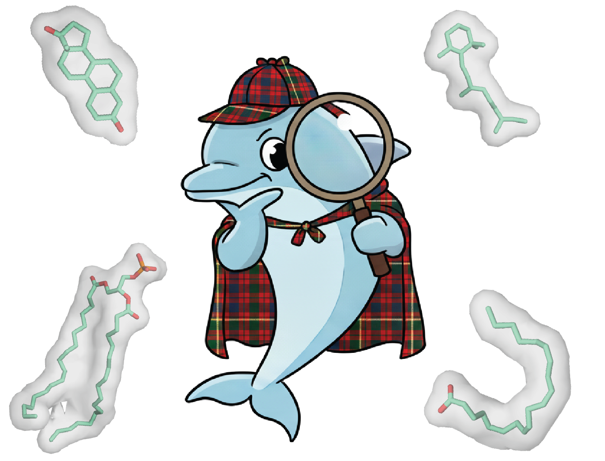

# LiPP_Benchmark

## Introduction

The Lipid–Protein Poses (LiPP) Benchmark is an open-source resource for evaluating protein-lipid docking/co-folding prediction workflows. 

Key functions of this repository:

- LiPP dataset: High-quality protein-lipid structure benchmarking datasets. 
- Code for reproducing the publication results

LiPP datasets are a subset of the BioDolphin dataset, a comprehensive protein-lipid structural dataset. Check out: https://biodolphin.chemistry.gatech.edu/

## Dataset availability:

The LiPP benchmark datasets are located in the `data/` directory with the following structure:

### CSV Files

- **LiPP_csvfiles/**: Directory containing IDs(BioDolphin IDs) with their metadata of the LiPP dataset:
    - `general_set.csv`: LiPP General set for benchmarking
    - `test_set.csv`: LiPP Test set for benchmarking (A subset of the general set with untrained data)
    - `example_set.csv`: Small example dataset for testing the workflows

### PDB Structures of the LiPP dataset

- `pdb_structures_complex/`: Contains pdb files of the native protein-lipid complex (named as BioDolphinID.pdb)
- `pdb_structures_split/`: contains directories named as BioDolphin IDs. Each directory contains the split structures (separating protein and lipid)  from the complex structures in `pdb_structures_complex/`.

## Guidance for reproducing the publications

To reproduce the results from our publications, follow the steps below to set up your environment and run the benchmarking workflows.

### Prerequisites

1. Before starting, ensure you have the following installed on your system (depending on what you what to test):

- AlphaFold3:  https://github.com/google-deepmind/alphafold3
- Chai-1: https://github.com/chaidiscovery/chai-lab
- DiffDock-L: https://github.com/gcorso/DiffDock
- AutoDock Vina: https://vina.scripps.edu/
- RoseTTAFold All-Atom: https://github.com/baker-laboratory/RoseTTAFold-All-Atom
- OpenStructure: https://openstructure.org/install
- ProteinCartography: https://github.com/Arcadia-Science/ProteinCartography

2. Specify the paths for these tools in the `config.yaml` file in the root directory of this repository

3. Install BioDolphin_vr1.1.csv from https://biodolphin.chemistry.gatech.edu/download and place it under `/data`

### Run the tools:

- `scripts/run_tools`: Contains scripts for running each tool. See the `README.md` files in each directory for detailed instructions. 

### Analyze the results:

- `scripts/analyze`: Contains scripts for analyzing the tools. See the `README.md` files in each directory for detailed instructions.  The main analyses of the publication can be found in `Evalaution/`. 

### Others:

- `scripts/filtering`: Contains scipts to filter BioDolphin datasets to obtain high quality complexes in LiPP.
